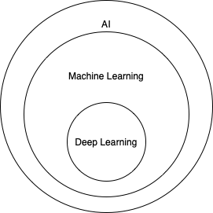

# machine-learning / AI tutorial

This is an incomplete tutorial to get into machine learning and AI.
I will explain the most basic algorithms and concepts without going into mathematical details.

* Section 1 will got through the general process for solving a problem, explaining all concepts, algorithms on base of the different steps you will have to undertake in a machine Learning project.
* Section 2 will give you examples using exactly the approach from Section 1 with different tools and languages.

Disclaimer: I will use my definition, this is not a scientific exploration.

## Machine Learning and AI

Artificial intelligence is the simulation of human intelligence processes by computer systems.
Any behaviour, even very simple behaviour can be understood as AI.

Machine Learning is major subset of AI.
It means that an algorithm can learn in a way, that an algorithm can improve performance based on data without direct programming. The output is defined by the input data, not by any predefined rules. I that way it differs from normal algorithm which have a static performance.

Deep Learning is a special subset, maily based on neuronal networks which will be explained later.

### Step 1 - Setup the Data

For simplification I will focus on table-based (tabular) data. Each column is a variable, called feature, dimension or attribute. Each row is an observation. Each column is known as vector and multiple vectors are called matrices.

#### 1.1 Data Scrubbing

The most data we get is dirty and lead to poor results if used in original state. Cleaning up the data and prepare for usage will drastically improve results.

**1.1.1 Feature Selection**

Identify the variable which are essential for your calculation. Delete not important or redundant columns.

**1.1.2 Row compression**

Aggregate/Merge rows (e.g. several rows might be identical, they might only differ in different types of fish, which can be reduced to just one line with the entry fish if the difference does not matter.)

**1.1.3 One-hot encoding**

Replace text values by values, in a perfect case true/false (1/0) values. e.g. make 2 columns from "fast luxury car" (fast-> 0/1, luxury->0/1)

**1.1.4 Binning**

Put concrete values into buckets/bins, e.g. Prizes higher than 100k could be treated as expensive = true instead of the concrete value.

**1.1.5 Normalization and Standardization**

It can be usefull to rescale and normalize the variables.

**1.1.6 Handling missing data (incomplete rows)**

If rows are lacking data you have the choice:

* Delete all uncomplete rows
* replace missing values by the median value
* replace the missing value by the most common variable value

#### 1.2 Split Learn and Test Data

In machine learning you will split input data in training and test data. The algorithm is trained by the training and the quality will be verified by the test data. Normally we use a ration of 70/30 or 80/20 (training/test). Before you split your data, it is important to randomize the row order.

### Step 2: Select the right algorithm

Machine Learning offers a huge amount of algorithms. I will show the most important algorithms here.

#### 2.1 Supervised Learning

Supervised Learning analyses combinations of known inputs and outputs to predict future outcomes based on new input data. That means you know that specific inputs (independent variables) lead to specific results (dependent variables).
With Supervised Learning each item must have labeled inputs and outputs.

**2.1.1 Linear Regression**

Linear regression tries to predict the concrete outcoume of input variable, using a regression line (hyperplane). For example you might have the whether of the last 30 year, then you might be able to predict the whether of next year.
The error is the distance between the hyperplane and the observed value.

y = (b x) + a

* y := dependent variable / outcome
* x := independent variable / input
* b := steepness
* a := y-intercept

Multiple Linear regression

y = (b1 x1) + (b2 x2) + ... + a

**2.2.2 Logistic Regression**

If we want to predict categorical outcomes instead of continous values (e.g. will the customer buy a product) logistic regression can be more effective.
It works well with 50-100 data points, but not with large datasets.

**2.2.3 k-nearest neighbors**

TODO

**2.1.1 Decision Tree Learning**

Decision Trees are a non-parametric supervised learning method used for both classification and regression tasks.
The idea is to create a model that predicts a result based on several input variables.
Nodes correspond input variables and edges lead to possible results of each variable.
A leaf represents a probability that all results of the path from root to the leave is true.
Decision trees are a type of supervised learning algorithms which can be used to predict outcomes.

One algorithm is C4.5. It selects as nodes the variables which most effectively split its set of samples into subsets.
This is done by using as splitting criterion the normalized information gain (which is difference in entropy).
The expected information gain is the change in information entropy H from a prior state to a state that takes some information as given.
It is used recursively from the root to the leafs.

    Entropy = - p(a)*log(p(a)) - p(b)*log(p(b))
    Information gain =  IG(T,a) = H(T) - H(T|a)

So in general:

* calculate all entropies for all variables and possible results.
* Now calculate all entropies for all variables under the condition that a result is given.
* Now you have the informations gains and you can select the highest one
* do this recursively until you reach the leaves

There are  other algorithm and other metrics, check https://en.wikipedia.org/wiki/Decision_tree_learning for more information for more details

One example is explained here http://technobium.com/decision-trees-explained-using-weka/
You can find the code for it in this repository as well (WekaDecisionTreeApplication).
It originally came from https://github.com/technobium/weka-decision-trees

#### 2.2 Unsupervised learning

Anaylzes inputs to generate an output.
The datasets are unlabeled, it is not known which inputs lead to specific outputs, instead we search for hidden patterns and relationships we were not aware of.

**2.2.1 Bayesian network**

A Bayesian network is designed to predict an outcome on conditions.
Means if you can say how likely something happen, given a certain condition,
then you can combine the different conditions.

Variables are nodes and edges are conditional probabilities

The math for conditional probability is simple, i will skip the implementation here.
Details are here https://en.wikipedia.org/wiki/Bayesian_network

**2.2.2 association rules learning**

A method for discovering interesting relations between variables in large databases.
Often used in e-commerce to predict an output on base of the occurrence of another event.

details see https://en.wikipedia.org/wiki/Association_rule_learning

**2.2.3 (k-means) clustering**

The idea of clustering is to group items together. This is interesting for example for Market research or Crime analysis.

One important algorithm is K-Means Clustering:

* Step 1: setup randomly some clusters/groups, a cluster is point which represents a centroid
* Step 2: assign each object to the cluster/group that is nearest (has the closest centroid).
* Step 3: When all objects have been assigned, recalculate the positions of the centroids.
* Repeat Steps 2 and 3 until the centroids no longer move.

#### 2.3 Reinforcement learning

Reinforcement learning randomly tries a high number of input variables. It tries to gain knowledge by iterating and use insights from previous iterations.
This algorithm is famous for games. In a chess game you know whether you won after 60 moves, but it is unclear which move had which impact.
In Q-Learning we are working with agents, which can have a set of states (S) and a set Actions (A).
The agent transitions randomly from state to state. Executing an action in a specific state provides the agent with a reward.

#### 2.4 Deep Learning

**2.4.1 neural network**

The core element behing a neural network is a perceptron.
A perceptron takes several binary inputs, x1,x2,… and produces a single binary output:

The inputs have different importance/impact, means they can be formalized as weights

Instead of a threshold a sigmoid function can be used as well (activation function)
This perceptrons can be layered as well.

Such a neural network can learn to predict/classify more or less everything in theory.			
In order to so this, the perfect weights must be learned.
There are several algorithms in place to simulate the learning.

A commonly used cost is the mean-squared error, which tries to minimize the average squared error between the network's output,
f(x), and the target value y over all the example pairs.

The following is a stochastic gradient descent algorithm for training a three-layer network (only one hidden layer):

    initialize network weights (often small random values)
    do
     forEach training example named ex
        prediction = neural-net-output(network, ex)
        actual = teacher-output(ex)
        compute error (prediction - actual) at the output units
        compute delta for all weights from hidden layer to output layer
        compute delta for all weights input layer to hidden layer
        update network weights // input layer not modified by error estimate
      until all examples classified correctly or another stopping criterion satisfied
    return the network

You can find an example calculation with weka in WekaNeuralNetworkExampleApplication

### Step 3 Select your tools

There are a lot of tools for differen programming languages available. I will try to list the most important tools.

**NumPy (python)**

open source lib with supports loading and work with large datasets

**SciKit-learn (python)**

Python lib which contains a lot of ML agorithms.
Great for most machine learning, not the best choice for neuronal networks.

**Pandas (python)**

Python Lib to works with data as virtual spreadsheet.

**R and R Studio**

Open Source programming language (and IDE) optimized for mathematical operations. Often used only for data mining.

**Tensorflow**

Machine Learning from Google which makes it possible to move the compute work to the google cloud. A great choice for neuronal networks because of the advanced algorithms and compute options in this area.

**Kera (python)**

Open Source deep Learning library, which is simple to use for most cases and it can run on top of tensor flow.

**Cafe**

open source lib for deep learning, great for image classification and image segmentation.

**Weka (java)**

weka is an open source machine learning library which includes a UI as well.
It is available as java library.
For some more details take a look under http://www.cs.waikato.ac.nz/ml/weka/.

**Hadoop (java, python)**

hadoop is a group of tools, the most known are the hadoop file system (HDFS) and the map reduce framework. HDFS allows a smart distribution of of huge files to several servers (by splitting them) and map reduce allows the smart spitting of tasks to several host
and the re-integration/merge of the distributed results. This way algorithms can be distributed over a bunch of servers.

**mahout (java, python)**

mahout is a framework which should help to execute scalable performant machine learning applications.
It can use Hadoop, Spark or Flink.

**YARN (java, python)**

Apache Hadoop NextGen MapReduce (YARN) / MapReduce 2.0 (MRv2)

The Hadoop system was based on the idea to
distribute the data with the assumptions that moving the algorithm is always cheaper.
Yarn is an improvement on top of hadoop MapReduce which adds a smart calculation (ResourceManager RM)
of calculation resources in order to distribute the calculation in a smart way. That massively improves performance.

**Spring XD (java)**

Spring XD an extensible system for real time data ingestion and processing.
Spring XD application consists of inputs, processors and sinks which can be connected to streams.
There are defaults inputs, processors and sinks, but you can write your own ones.

### Step 4 - Calculate the quality of results

After you executed you run, it is time to measure how well the model performed.

**4.1 Calculate error**

There are different metrics:

* Area under Curve (AUC)
* Receiver Operating Characteristic (ROC)
* confusion matrix
* root mean square error (RMSE)
* absolute error (MAE), which measures the average of the errors

**4.2 Cross and k-fold validation**

In order to verify that the training set was not luckily choosen, it can make sense to testing all combinations to divide the original set into training and test set.
If that costs too much computing time and power, several randomly choosen splits (k-fold validation) could be used.

**4.3 Check relationships between variables**

Using a matrix of relationships/correlation scores between variable in order to remove redundant variables.

### Step 5 - Tune and repeat

After having results and a data how well the algorithm performed, it is time to tweak and repeat the step.

We will try to modify the settings (called hyperparameters) of the algorithm.

## Examples for coders

Here are some samples with installation guides and step by step execution plans:

* [Hadoop by example](HadoopExamples.md)
* [Mahout by association rules learning example ](MahoutExamples.md)
* [SpringXD by example](SpringXDExamples.md)
