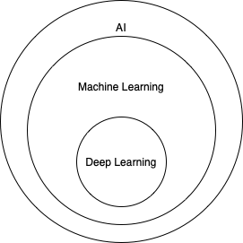
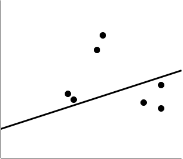
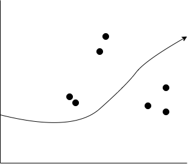
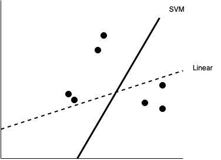
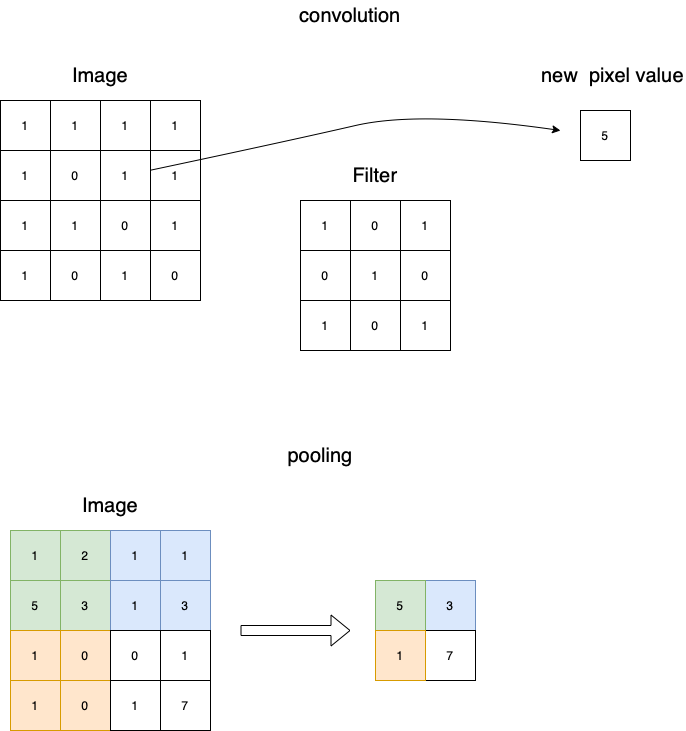

# machine-learning / AI tutorial

This is an incomplete tutorial to get into machine learning and AI.
I will explain the most basic algorithms and concepts without going into mathematical details.
I am not a machine learning expert or data scientist,
I am an engineer and I use this in order to learn more about machine learning.

* Section 1 will got through the general process for solving a problem using ML and AI techniques.
I will give a short intro into the concepts and algorithms. This section is organized in steps. If you undertake a project, then you will probably run exactly through these steps.
* Section 2 will give you examples using exactly the approach from Section 1 with different tools and languages.

Disclaimer: I will use my definitions, this is not a scientific exploration.

## Machine Learning and AI

Artificial intelligence is the simulation of human intelligence processed by computer systems.
Any behaviour, even very simple behaviour can be understood as AI.

Machine Learning can be understood as subset of AI.
Software developed with classical programming differs from machine learning.   
In classical programming you define and codify the rules which are used to convert input data into output data. The performance is static in that way. Logic you do not implement, will not be applied.  If you use machine learning then you don't not know the rules. Instead you define the input data which result in specific output data. The model is then trained to learn the rules themselves.
It means that an algorithm can learn in a way, that an algorithm can improve performance based on data without direct programming. The output is defined by the input data, not by any predefined rules. I that way it differs from normal algorithms which have a static performance, because it gets better with more data.

Deep Learning is a special subset, mainly based on neuronal networks which will be explained later.

### Step 1 - Setup the Data

For simplification I will focus on table-based (tabular) data. Each column is a variable, called feature, dimension or attribute. Each row is an observation. Each column is known as vector and multiple vectors are called matrices.

#### 1.1 Data Scrubbing

The most data we get is dirty and lead to poor results if used in original state. Cleaning up the data and prepare for usage will drastically improve results.

**1.1.1 Feature Selection**

Identify the variables which are essential for your calculation. Delete not important or redundant columns.

**1.1.2 Row compression**

Aggregate/Merge rows (e.g. several rows might be identical, they might only differ in different types of subtypes, which can be reduced to just one line if the difference between the subcategories does not matter.)

**1.1.3 One-hot encoding**

Replace text values by values, in a perfect case true/false (1/0) values. e.g. make 2 columns from "fast luxury car" (fast-> 0/1, luxury->0/1)

**1.1.4 Binning**

Put concrete values into buckets/bins, e.g. Prizes higher than 100k could be treated as expensive = true instead of the concrete value.

**1.1.5 Normalization and Standardization**

It can be usefull to rescale and normalize the variables.

**1.1.6 Handling missing data (incomplete rows)**

If rows are lacking data you have the choice:

* Delete all uncomplete rows
* replace missing values by the median value
* replace the missing value by the most common variable value

#### 1.2 Split Learn and Test Data

In machine learning you will split input data in training and test data. The algorithm is trained by the training and the quality will be verified by the test data. Normally we use a ration of 70/30 or 80/20 (training/test). Before you split your data, it is important to randomize the row order.

### Step 2: Select the right algorithm

Machine Learning offers a huge amount of algorithms. I will show the most important algorithms here.

#### 2.1 Supervised Learning

Supervised Learning analyses combinations of known inputs and outputs to predict future outcomes based on new input data. That means you know that specific inputs (independent variables) lead to specific results (dependent variables).
With Supervised Learning each item must have labeled inputs and outputs.

**2.1.1 Linear Regression**

Linear regression tries to predict the concrete outcoume of input variable, using a regression line (hyperplane). For example you might have the wheather data of the last 30 years, then you might be able to predict the whether of next year.
The error is the distance between the hyperplane and the observed value.

y = (b x) + a

* y := dependent variable / outcome
* x := independent variable / input
* b := steepness
* a := y-intercept

Multiple Linear regression

y = (b1 x1) + (b2 x2) + ... + a

**2.1.2 Logistic Regression**

If we want to predict categorical outcomes instead of continous values (e.g. will the customer buy a product) logistic regression can be more effective.
It works well with 50-100 data points, but not with large datasets.

**2.1.3 k-nearest neighbors**

k-NN classifies new data points based on their nearby data points, not recommended for large datasets or high number of features.

**2.1.4 Decision Tree Learning and random forest**

Decision Trees are a non-parametric supervised learning method used for both classification and regression tasks.
The idea is to create a model that predicts a result based on several input variables.
Nodes correspond input variables and edges lead to possible results of each variable.
A leaf represents a probability that all results of the path from root to the leave is true.
Decision trees are a type of supervised learning algorithms which can be used to predict outcomes.

One algorithm is C4.5. It selects as nodes the variables which most effectively split its set of samples into subsets.
This is done by using as splitting criterion the normalized information gain (which is difference in entropy).
The expected information gain is the change in information entropy H from a prior state to a state that takes some information as given.
It is used recursively from the root to the leafs.

    Entropy = - p(a)*log(p(a)) - p(b)*log(p(b))
    Information gain =  IG(T,a) = H(T) - H(T|a)

So in general:

* calculate all entropies for all variables and possible results.
* Now calculate all entropies for all variables under the condition that a result is given.
* Now you have the informations gains and you can select the highest one
* do this recursively until you reach the leaves

Calculating all possible combinations (means recalculate all entropies under all possible combinations of a given decision) can be very time consuming.
So often bagging is used, which means that to grow several decision trees using a randomized selection of input data.
Most often **random forest** is used as algorithm, which grows several decision trees, but limits the choice of variables in each split.

There are other algorithms and other metrics, check https://en.wikipedia.org/wiki/Decision_tree_learning for more information for more details

**2.1.5 Bayesian network**

A Bayesian network is designed to predict an outcome on conditions.
Means if you can say how likely something happen, given a certain condition,
then you can combine the different conditions.

Variables are nodes and edges are conditional probabilities

The math for conditional probability is simple, I will skip the implementation here.
Details can be found under https://en.wikipedia.org/wiki/Bayesian_network

**2.1.6 Support Vector machines**

SVM are used as a classification technique for predicting categorical outcomes.
It is comparable with logistic regression.
Instead of just seperating the categories by an hyperplane, it tries to find the maximum distance of the plane to the points.

#### 2.2 Unsupervised learning

Anaylzes inputs to generate an output.
The datasets are unlabeled, it is not known which inputs lead to specific outputs, instead we search for hidden patterns and relationships we were not aware of.

**2.2.1 association rules learning**

A method for discovering interesting relations between variables in large databases.
Often used in e-commerce to predict an output on base of the occurrence of another event.

details see https://en.wikipedia.org/wiki/Association_rule_learning

**2.2.2 (k-means) clustering**

The idea of clustering is to group items together.
So we try to find data point which share similar attributes.
This is interesting for example for Market research.

The most important algorithm is K-Means Clustering:

* Step 1: setup randomly some clusters centers (centroids).
* Step 2: assign each object to the cluster that is nearest (has the closest centroid) using for example the euclidean distance.
* Step 3: When all objects have been assigned, recalculate the positions of the centroids.
* Repeat Steps 2 and 3 until the centroids no longer move.

#### 2.3 Reinforcement learning

Reinforcement learning randomly tries a high number of input variables. It tries to gain knowledge by iterating and use insights from previous iterations.
This algorithm is famous for games. In a chess game you know whether you won after 60 moves, but it is unclear which move had which impact.
In Q-Learning we are working with agents, which can have a set of states (S) and a set Actions (A).
The agent transitions randomly from state to state. Executing an action in a specific state provides the agent with a reward.

#### 2.4 Deep Learning

**2.4.1 neural network**

We could say that neuronal networks is just a supervised learnings algorithm but for me it is a seperated category because in contrast to the other algortithm it is a black box.
I can train a network but I cannot explain clearly why it reacts like it does. 2 different networks could have complete different weights and settings and come to nearly the same result.
This is perfect for problems which are easy to solve for human beings but difficult for computers. It works great for pattern detection. Even if that is maybe the most exciting approach, it is expensive/slow in comparison to simpler algorithms and for a lot of cases not the best way to go. For simple detections a decisions tree might be good enough already.

The core element behind a neural network is a perceptron.
A perceptron takes several binary inputs, x1,x2,… and produces a single binary output:

The inputs have different importance/impact, means they can be formalized as weights

Instead of a threshold a sigmoid function can be used as well (activation function)
This perceptrons can be layered as well.

Such a neural network can learn to predict/classify more or less everything in theory.			
In order to so this, the perfect weights must be learned.
There are several algorithms in place to simulate the learning.

A commonly used cost is the mean-squared error, which tries to minimize the average squared error between the network's output,
f(x), and the target value y over all the example pairs.

The following is a stochastic gradient descent algorithm for training a three-layer network (only one hidden layer):

    initialize network weights (often small random values)
    do
     forEach training example named ex
        prediction = neural-net-output(network, ex)
        actual = teacher-output(ex)
        compute error (prediction - actual) at the output units
        compute delta for all weights from hidden layer to output layer
        compute delta for all weights input layer to hidden layer
        update network weights // input layer not modified by error estimate
      until all examples classified correctly or another stopping criterion satisfied
    return the network

In order to solve complex problems several layers are often used, means the results of one layer is the input for the next layer. Stacking several layers (e.g. 150 for identifying vehicles) makes it deep.

**CNN - convolutional neural networks**

Sometime a classical neural network is not enough.
So we implemented a neural network which can detect clothes.
Often data is not perfectly prepared, so matching exact datasets might not be good enough.

In a real world scenario images might be not in perfect zoom and rotation.
So instead of mapping pixels we might want to identify patterns/features.
Therefore CNNs are a good fit.

Convolution is a nothing else then a filter of weights that are used to multiply a pixel with its neighbors. So we multiple the values of the pixel including the surrounding with the weight and sum that up.

This is improved with pooling.
That means we use the take the maximum of a pixel block as value.
This way we eliminate pixel with lower importance.

This is used in convolutional neural networks (CNN).

**RNN - Recurrent neural network**

Often data is not context free. In reality data often depends on the data before.
Understanding a video for example works different to to understand a single image.
For such cases a Recurrent neural network is a good fit.
An output not just depends on the input, instead the values before influence the output in a weighted fashion.
Recurrent networks can have additional stored states, and the storage can be under direct control by the neural network.
The storage can also be replaced by another network or graph if that incorporates time delays or has feedback loops.
Such controlled states are referred to as gated state or gated memory, and are part of long short-term memory networks (LSTMs) and gated recurrent units.
Such LSTMs can be stacked as well.

**Dropout Regularization**
One of the weapons against overfitting in neural networks is Dropout Regularization. During training you remove a random number of neurons.
This makes the algorithm often more resilient.

### Step 3 Select your tools and implement the algorithm

There are a lot of tools for different programming languages available. I will try to list the most important tools here.

**NumPy (python)**

Open source lib with supports loading and work with large datasets.

**SciKit-learn (python)**

Python lib which contains a lot of ML agorithms.
Great for most machine learning, not the best choice for neuronal networks.

**jupyter**

JupyterLab (https://jupyter.org) is a web-based interactive development environment for Jupyter notebooks. That means you start a webservice and then you can code in a browser.
The programms are stored as notebooks. Python and all the libs including tensorflow are supported and the algorithm can be stored in a way that in can be viewed in a browser and stored in version control.

**Pandas (python)**

Python Lib to works with data as virtual spreadsheet.

**R and R Studio**

Open Source programming language (and IDE) optimized for mathematical operations. Often used only for data mining.

**Tensorflow**

Machine Learning from Google which makes it possible to execute ML locally and to move the compute work to the google cloud.
Tensorflow is a great choice for neuronal networks because of the advanced algorithms and compute options in this area.

Tensorflow consists of:

* Tensorflow Hub - a repository of models for doing all the logic ML
* Tensorflow Lite - for calculating output on mobile phones or Raspberry Pi,..
* a distribution logic to move the calculation to the cloud or on devices
* some predefined Test Datasets

**Keras (python)**

Open Source deep Learning library, which is simple to use for most cases and it can run on top of tensor flow.

**Cafe**

open source lib for deep learning, great for image classification and image segmentation.

**Weka (java)**

weka is an open source machine learning library which includes a UI as well.
It is available as java library.
For some more details take a look under http://www.cs.waikato.ac.nz/ml/weka/.

**Hadoop (java, python)**

hadoop is a group of tools, the most known are the hadoop file system (HDFS) and the map reduce framework. HDFS allows a smart distribution of of huge files to several servers (by splitting them) and map reduce allows the smart spitting of tasks to several host
and the re-integration/merge of the distributed results. This way algorithms can be distributed over a bunch of servers.

**mahout (java, python)**

mahout is a framework which should help to execute scalable performant machine learning applications.
It can use Hadoop, Spark or Flink.

**YARN (java, python)**

Apache Hadoop NextGen MapReduce (YARN) / MapReduce 2.0 (MRv2)

The Hadoop system was based on the idea to
distribute the data with the assumptions that moving the algorithm is always cheaper.
Yarn is an improvement on top of Hadoop MapReduce which adds a smart calculation (ResourceManager RM)
of calculation resources in order to distribute the calculation in a smart way. That massively improves performance.

**Spring XD (java)**

Spring XD an extensible system for real time data ingestion and processing.
Spring XD application consists of inputs, processors and sinks which can be connected to streams.
There are defaults inputs, processors and sinks, but you can write your own ones.

**getting started package**

If you want to start local, then I recommend to start with python.
The most ML libraries are available in python.
For most users it makes sense to start with python and either jupyter notebooks or pyCharm.
From there we can use python to implement ML algorithms with SciKit (for non-deep learning tasks) or Tensorflow (for deep learning).
Pandas and numPy makes it easier to handle data.
I recommend to start with:
* [Getting started with python and jupyter and SciKit - House Pricing Prediction](example-jupyter-1/example-jupyter-1.md)
* [Getting started with pyCharm and tensorflow - Predict Clothing](example-pycharm-tensorflow-2/README.md)

Take a look into [install the tools guide](installTools.md) to if you want to know how to install the needed tools.
This 2 examples will show you the most often used libs in python: jupyter, pyCharm, SciKit, Keras, numPy, Pandas
and different ways of setting up ml environments (browser vs IDE).
That will give you a feeling how you would like to work.

If you want to implement BI applications which are running in an automated fashion as part of you ecosystem in a local datacenter,
then you might later take a look into Hadoop or other platforms.  

If you want to integrate some ml in existing applications, then libs like weka or others might be relevant.

### Step 4 - Calculate the quality of results

After you executed you run, it is time to measure how well the model performed.

**4.1 Calculate error**

There are different metrics:

* Area under Curve (AUC)
* Receiver Operating Characteristic (ROC)
* confusion matrix
* root mean square error (RMSE)
* absolute error (MAE), which measures the average of the errors
* ...

**4.2 Cross and k-fold validation**

In order to verify that the training set was not luckily choosen, it can make sense to testing all combinations to divide the original set into training and test set.
If that costs too much computing time and power, several randomly choosen splits (k-fold validation) could be used.

**4.3 Check relationships between variables**

Using a matrix of relationships/correlation scores between variable in order to remove redundant variables.

### Step 5 - Tune and repeat

After having results and a data how well the algorithm performed, it is time to tweak and repeat the step.

Try to modify the settings (called hyperparameters) of the algorithm.

**Unser and Overfitting**

As Bias we understand the gap between the value predicted and the actual value.
It is the prediction error.
As Variance we understand how scattered or predicted values are.
In Ideal World you would get a situation where the variance and the bias is low.
In Real world you often have to find a trade off between both.
Underfitting you normally can detect by low variance, but high bias (prediction error). Overfitting can be detected when the algorithm is much better at the test data then it is with the verification data and by high variance with low bias.

**Ensemble learning**

Often you get the best results when you combine models/algorithms.
You can for example use the result of one subcalculation as input for another algorithm (stacking).

An important approach is Gradient boosting.
Gradient boosting is typically used with decision trees.
It does not use different algorithms, but it build several models and tweaks the model in the direction of minimizing the error.

## Examples for coders

Here are some samples with installation guides and step by step execution plans:

* [install the tools](installTools.md)
* [Getting started with python and jupyter and SciKit - House Pricing Prediction](example-jupyter-1/example-jupyter-1.md)
* [Getting started with pyCharm and tensorflow - Predict Clothing with neural network](example-pycharm-tensorflow-2/README.md)
* [Load data into tensorflow](load-data-into-tensorflow.md)
* [Calculate a model with tensorflow and use it with tensorflow lite on android and with TF serving in docker](example-pycharm-tensorflow-3/tensorflow-on-android.md))

TODO update:

* [Decision Tree with Java and Weka originally takes from https://github.com/technobium/weka-decision-trees](java-examples/src/main/java/WekaDecisionTreeApplication.java)
* [Hadoop by example](HadoopExamples.md)
* [Mahout by association rules learning example ](MahoutExamples.md)
* [SpringXD by example](SpringXDExamples.md)
* [Neuronal networks in java with Weka](./java-examples/src/main/java/WekaNeuralNetworkExampleApplication.java)

## learning and datasets

Here are some useful learning links:

* machine learning with scikit - https://scikit-learn.org/stable/
* open source machine learning - tensorflow - https://www.tensorflow.org
* UCI machine learning (free datasets) - https://archive.ics.uci.edu/ml/index.php
* kaggle challenges - https://www.kaggle.com

here are some list of research datasets:

* kaggle offers datasets with challenges https://www.kaggle.com
* datasets aws - https://registry.opendata.aws
* open portal lists - http://dataportals.org/search
* opendata list - https://opendatamonitor.eu
* MNIST dataset https://en.wikipedia.org/wiki/MNIST_database
* Wikipedia list of research datasets https://en.wikipedia.org/wiki/List_of_datasets_for_machine-learning_research
