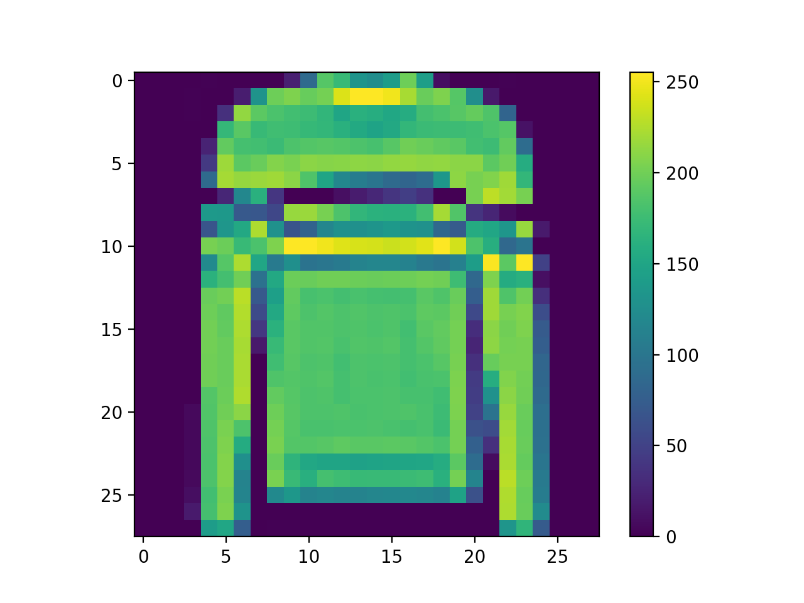

# example - clothings recognition with tensorflow with pyCharm

## Before you start

I assume you have PyCharm installed.
Please setup a project with PyCharm and tensorflow as described under [install the tools](./../installTools.md).
If you don't want to use the pyCharm and want to use a jupyter notebook instead,
then you might have to modify some small things, but in general it should work exactly the same way.

This example follows more or less with some adaptions the google tutorial:
https://www.tensorflow.org/tutorials/keras/classification
A corresponding jupyther notebook is available from google under https://github.com/tensorflow/docs/blob/master/site/en/tutorials/keras/classification.ipynb

## the building block you have to understand

**MNIST fashion dataset**

The MNIST database (Modified National Institute of Standards and Technology database, see https://en.wikipedia.org/wiki/MNIST_database)
is used to train a model to detect handwritten numbers.
The dataset contains 70k sets with 28x28 grey scaled pixel images.
We will use the same idea, but instead we will use a dataset from Zalando which contains images of clothings
(https://www.kaggle.com/zalando-research/fashionmnist).
It contains 60,000 examples and a test set of 10,000 examples.
Each example is a 28x28 grayscale image, associated with a label from 10 classes.
We will use a neuronal network to predict whether an image fits to an label, means whether it is a Sneaker or a Shirt.
The fashion mnist dataset is included in the tensorflow sample datasets

**Setup model**

In tensorflow you can define layers of your network with Sequential.
Inside the Sequential element you define how the layer looks like
See https://www.tensorflow.org/api_docs/python/tf/keras/Sequential for details.
The output of one layer is the input for the next layer.

In our case we want to have at least 3 layers.

The first layer converts the image array (28x28 pixel) into a one dimensional array with 784 pixels.
That makes the following calculations easy.
The second layer is doing the real work, it consist of 128 neurons.
The third layer maps the result on our classes.
Means we want to know for each class (e.g. shirt) how likely an image fits into a specific class.

```
tf.keras.Sequential([
    tf.keras.layers.Flatten(input_shape=(28, 28)),
    tf.keras.layers.Dense(128, activation='relu'),
    tf.keras.layers.Dense(10)
])
```

The model has to know whether a result was good,
so it needs a method to calculate the error.
It optimizes using that method.

A very simple model could use:

```
model.compile(optimizer='sgd', loss='mse')
```

We will use:

```
model.compile(
  optimizer='adam', 
  loss=tf.keras.losses.SparseCategoricalCrossentropy(from_logits=True), 
  metrics=['accuracy']
)
```

For details about optimizers and error functions, check:
* https://www.tensorflow.org/api_docs/python/tf/keras/optimizers
* https://www.tensorflow.org/api_docs/python/tf/keras/losses
* https://www.tensorflow.org/api_docs/python/tf/keras/metrics

Starting the learning process is done by:

```
model.fit(training_images, training_labels, epochs=10)
```

A single predicted probability can be done by

```
model.predict(sample_image, sample_label)
```

## the code line by line

This is a python script for example for use in pyCharm.
The corresponding sample from google can be found under https://github.com/tensorflow/docs/blob/master/site/en/tutorials/keras/classification.ipynb

```
# First we want to import the libraries we need
# this is TensorFlow and the Keras libs from tensorflow for machine learning
# and some usefull libs like numpy (handling data) and matplotlib (print graphs)

import tensorflow as tf
import numpy as np
import matplotlib.pyplot as plt

# Main function
# In PyCharm you can execute the code, by clicking on the run button at the top
if __name__ == '__main__':

    #########################
    # Step 1: load the data #
    #########################

    # let's load the fashion_mnist dataset, which is included in the tensorflow sample datasets
    # so no need to download it manually from the internet

    fashion_mnist_full_dataset = tf.keras.datasets.fashion_mnist

    # let's split the data into a training and a testset
    (training_images, training_labels), (test_images, test_labels) = fashion_mnist_full_dataset.load_data()

    # let's define the output classes
    class_names = ['T-shirt/top', 'Trouser', 'Pullover', 'Dress', 'Coat', 'Sandal', 'Shirt', 'Sneaker', 'Bag',
                   'Ankle boot']

    # the training set contains 60000 images with 28 x 28 Pixels, the test set 10000 images with 28 x 28 Pixels
    print('\nThe training set structure :', training_images.shape)
    # -> The training set structure : (60000, 28, 28)
    print('\nThe test set structure :', test_images.shape)
    # -> The test set structure : (10000, 28, 28)
    print('\nThe training set size :', len(training_labels))
    # -> The training set size : 60000
    print('\nThe test set size :', len(test_labels))
    # -> The test set size : 10000

    ############################
    # Step 2: prepare the data #
    ############################

    # let's have a look into the data by plotting a sample image on screen
    plt.figure()
    plt.imshow(training_images[5])
    plt.colorbar()
    plt.grid(False)
    plt.show()
    # the pixels have values between 0 and 255, which is normal for a grey scaled image, but
    # the algorithm works better if the data is scaled between 0 and 1, so lets divide all values by 255
    # and then print the first 16 in order to check whether we' done it right
    training_images = training_images / 255.0
    test_images = test_images / 255.0
    plt.figure(figsize=(10, 10))
    for i in range(16):
        plt.subplot(4, 4, i + 1)
        plt.xticks([])
        plt.yticks([])
        plt.grid(False)
        plt.imshow(training_images[i], cmap=plt.cm.binary)
        plt.xlabel(class_names[training_labels[i]])
    plt.show()

    ###########################
    # Step 3: build the model #
    ###########################

    # neuronal networks are organized in layers
    # first layer converts 28x28 pixels into one dimensional array with 784 pixels
    # second layer has 128 neurons
    # third layer maps results to classes
    model = tf.keras.Sequential([
        tf.keras.layers.Flatten(input_shape=(28, 28)),
        tf.keras.layers.Dense(128, activation='relu'),
        tf.keras.layers.Dense(10)
    ])
    model.compile(
        optimizer='adam',
        loss=tf.keras.losses.SparseCategoricalCrossentropy(from_logits=True),
        metrics=['accuracy']
    )
    model.fit(training_images, training_labels, epochs=10)
    # -> this will lead to an accuracy of our training set of about 91%

    ##############################################
    # Step 4: calculate the quality of the model #
    ##############################################
    test_loss, test_acc = model.evaluate(test_images, test_labels, verbose=2)
    print('\naccuracy of our model against our test set:', test_acc)
    # -> accuracy of our model against our test set: 0.8813999891281128
    # so our accuracy of the model against the test set was 91%, but it is only 88% against the test set
    # So we have a case of overfitting
    # we accept this in our sample

    ########################################
    # Step 5: let's predict a sample image #
    ########################################
    probability_model = tf.keras.Sequential([model, tf.keras.layers.Softmax()])
    predictions = probability_model.predict(test_images)
    print('\nshow probabilities for different classes:', predictions[0])
    print('\nthe most likely class for our sample is:', np.argmax(predictions[5]))
    print('\nthe most likely class name for our sample is:', class_names[np.argmax(predictions[5]) + 1])
```

this algorithm will create outputs like this:

```
The training set structure : (60000, 28, 28)
The test set structure : (10000, 28, 28)
The training set size : 60000
The test set size : 10000
```




```
Train on 60000 samples
Epoch 1/10
60000/60000 [==============================] - 5s 82us/sample - loss: 0.4969 - accuracy: 0.8269
...
Epoch 10/10
60000/60000 [==============================] - 5s 88us/sample - loss: 0.2392 - accuracy: 0.9099

accuracy of our model against our test set: 0.8824

show probabilities for different classes: [1.7980218e-11 1.3179775e-11 5.6693504e-12 8.0764773e-13 7.4736645e-10
 1.3517757e-02 2.5008634e-10 4.3097772e-03 3.8003131e-10 9.8217255e-01]

the most likely class for our sample is: 1

the most likely class name for our sample is: Pullover
```