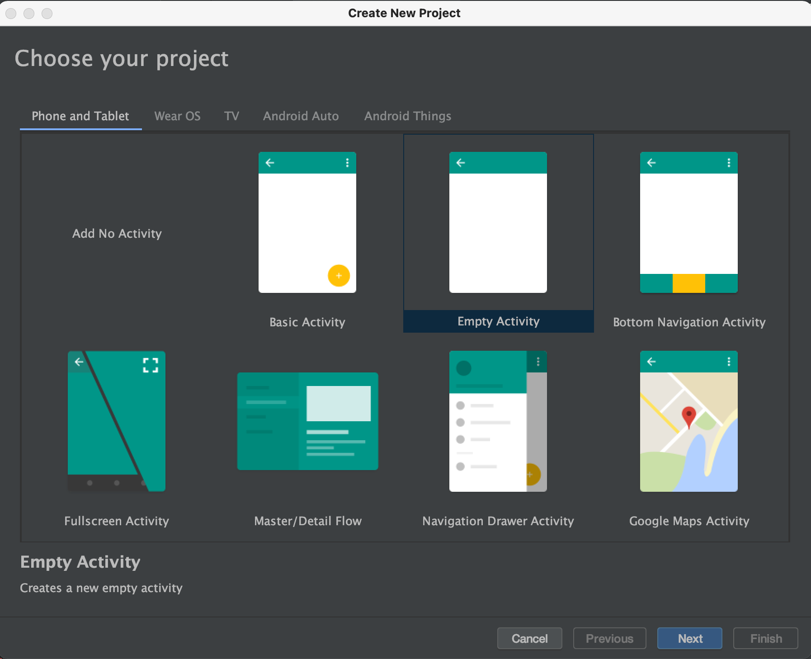
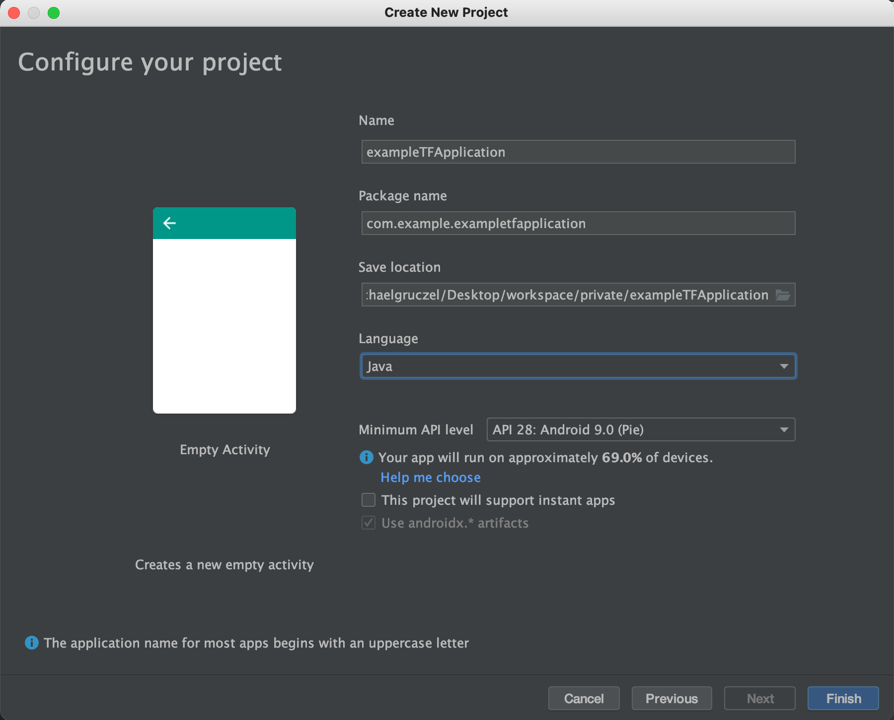
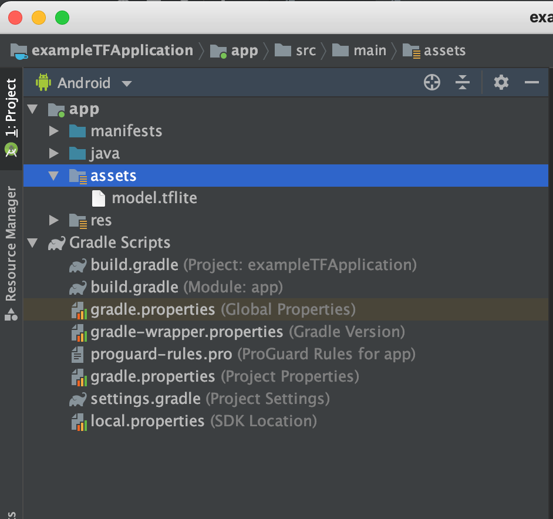
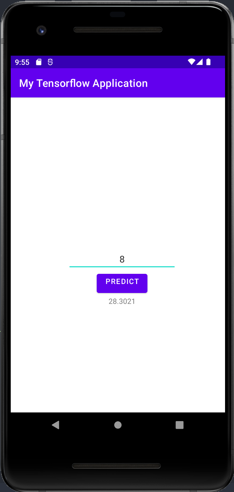

# use tensorflow with tensorflow lite on android and TF serving in docker

We will setup some fibonacci numbers and let a very simple neural network learn it.
This is of course no usefull use case, since the rules for fibonacci numbers are known and
the simple neural network will produce poor results.
I just want to show how to export a model (learned weights) to a file and then use it
later to predict values usinf Tensorflow lite in android and TF serving

## build the model and export it

I assume you have PyCharm installed.
Please setup a project with PyCharm and tensorflow as described under [install the tools](./../installTools.md).
If you don't want to use the pyCharm and want to use a jupyter notebook instead,
then you might have to modify some small things, but in general it should work exactly the same way.

```

import tensorflow as tf
import numpy as np
import pathlib as pl
from tensorflow.keras import Sequential
from tensorflow.keras.layers import Dense

if __name__ == '__main__':

  # we will let a very simple neural network learn fibonacci numbers
  input_values =      np.array([-1.0, 0.0, 1.0, 2.0, 3.0, 4.0, 5.0, 6.0, 10.0], dtype=float)
  prediction_values = np.array([ 0.0, 0.0, 1.0, 1.0, 2.0, 3.0, 5.0, 8.0, 55.0], dtype=float)

  # on layer should do it
  learning_layer = Dense(units=1, input_shape=[1])
  model = Sequential([learning_layer])
  model.compile(optimizer='sgd', loss='mean_squared_error')
  model.fit(input_values, prediction_values, epochs=500)

  # let's see what it predicts for 8.0, the correct value would be 21
  print('\nPrediction for 8 (correct value is 21):', model.predict([8.0]))

  # export the learned weights, so that we can later use them in tensor serving and TF Lite
  print("learned weights {}".format(learning_layer.get_weights()))
  export_dir = 'learned_model/1'
  tf.saved_model.save(model, export_dir)
  converter = tf.lite.TFLiteConverter.from_saved_model(export_dir)
  tflite_model = converter.convert()
  tflite_model_file = pl.Path('model.tflite')
  tflite_model_file.write_bytes(tflite_model)

  # test whether loading model would work
  interpreter = tf.lite.Interpreter(model_content=tflite_model)
  interpreter.allocate_tensors()
  input_details = interpreter.get_input_details()
  output_details = interpreter.get_output_details()
  to_predict = np.array([[8.0]], dtype=np.float32)
  interpreter.set_tensor(input_details[0]['index'], to_predict)
  interpreter.invoke()
  tflite_results = interpreter.get_tensor(output_details[0]['index'])
  print('\nPrediction for 8 after importing weights from export (correct value is 21):', tflite_results)

```
our model will predict 28.3021 for the 8th fibonacci number, which is a poor result
but fine for showing how to import that model.

## use the learned weights with Tensorflow serving in docker

```
$TESTDATA="$(pwd)"
$docker run -t --rm -p 8501:8501 \
    -v "$TESTDATA/learned_model:/models/learned_model" \
    -e MODEL_NAME=learned_model \
    tensorflow/serving &
```
Query the model using the predict API will return that same result

```
$ curl -d '{"instances": [[8.0]]}' -X POST http://localhost:8501/v1/models/learned_model:predict

{"predictions": [[28.3021]]
```

## use that model in android

**create empty project**

create a new empty android project with android Studio with an empty activity.




**add tensorflow lib**

add the tensorflow lib to your dependencies in build.gradle

```

android {
    ...
    androidResources {
        noCompress 'tflite'
    }
}


dependencies {
    ...
    implementation 'org.tensorflow:tensorflow-lite:0.0.0-nightly-SNAPSHOT'
}
```

**add the learned model**

create folder assets in src/main and copy model.tflite into that folder



**use the model**

we will now change the ui of the main activity to have a button to start the prediction
and a field to enter the number to predict.

first adapt the layout (activity_main.xml):

```
<?xml version="1.0" encoding="utf-8"?>
<androidx.constraintlayout.widget.ConstraintLayout xmlns:android="http://schemas.android.com/apk/res/android"
    xmlns:app="http://schemas.android.com/apk/res-auto"
    xmlns:tools="http://schemas.android.com/tools"
    android:layout_width="match_parent"
    android:layout_height="match_parent"
    tools:context=".MainActivity">

    <EditText
        android:id="@+id/editText"
        android:layout_width="wrap_content"
        android:layout_height="wrap_content"
        android:layout_marginStart="16dp"
        android:layout_marginLeft="16dp"
        android:layout_marginTop="16dp"
        android:ems="10"
        android:inputType="number"
        android:gravity="center_horizontal"
        app:layout_constraintLeft_toLeftOf="parent"
        app:layout_constraintRight_toRightOf="parent"
        app:layout_constraintTop_toTopOf="parent"
        app:layout_constraintBottom_toBottomOf="parent"
        />

    <Button
        android:id="@+id/button"
        android:layout_width="wrap_content"
        android:layout_height="wrap_content"
        android:layout_marginEnd="16dp"
        android:layout_marginStart="16dp"
        android:gravity="center_horizontal"
        android:text="predict"
        app:layout_constraintTop_toBottomOf="@+id/editText"
        app:layout_constraintStart_toStartOf="@+id/editText"
        app:layout_constraintEnd_toEndOf="@+id/editText"
        />

    <TextView
        android:id="@+id/prediction"
        android:layout_width="wrap_content"
        android:layout_height="wrap_content"
        android:layout_marginEnd="16dp"
        android:layout_marginStart="16dp"
        android:gravity="center_horizontal"
        android:text="-"
        app:layout_constraintTop_toBottomOf="@+id/button"
        app:layout_constraintStart_toStartOf="@+id/button"
        app:layout_constraintEnd_toEndOf="@+id/button"
        />

</androidx.constraintlayout.widget.ConstraintLayout>
```

now lets use it in code:

```
public class MainActivity extends AppCompatActivity {

    private ByteBuffer tflitemodel = null;
    private Interpreter tflite = null;
    private EditText txtValue = null;
    private TextView prediction = null;

    @Override
    protected void onCreate(Bundle savedInstanceState) {
        super.onCreate(savedInstanceState);
        setContentView(R.layout.activity_main);

        try{
            tflitemodel = loadModelFile(this.getAssets(), "model.tflite");
            tflite = new Interpreter(tflitemodel);
        } catch(Exception ex){
            ex.printStackTrace();
        }

        final var executeButton = findViewById(R.id.button);
        executeButton.setOnClickListener(new View.OnClickListener() {
            @Override
            public void onClick(View v) {
                Float userVal =  Float.valueOf(txtValue.getText().toString());
                ByteBuffer outputVal = ByteBuffer.allocateDirect(4);
                outputVal.order(ByteOrder.nativeOrder());
                tflite.run(userVal, outputVal);
                outputVal.rewind();
                Float result = outputVal.getFloat();
                prediction.setText("" + result);
            }
        });

        txtValue = findViewById(R.id.editText);
        prediction = findViewById(R.id.prediction);

    }

    private ByteBuffer loadModelFile(AssetManager assetManager, String modelPath) throws Exception {
        final var fileDescriptor = assetManager.openFd(modelPath);
        final var inputStream = new FileInputStream(fileDescriptor.getFileDescriptor());
        final var fileChannel = inputStream.getChannel();
        final var startOffset = fileDescriptor.getStartOffset();
        final var declaredLength = fileDescriptor.getDeclaredLength();
        return fileChannel.map(FileChannel.MapMode.READ_ONLY, startOffset, declaredLength);
    }
}
```
more example can be found under https://www.tensorflow.org/lite/examples


