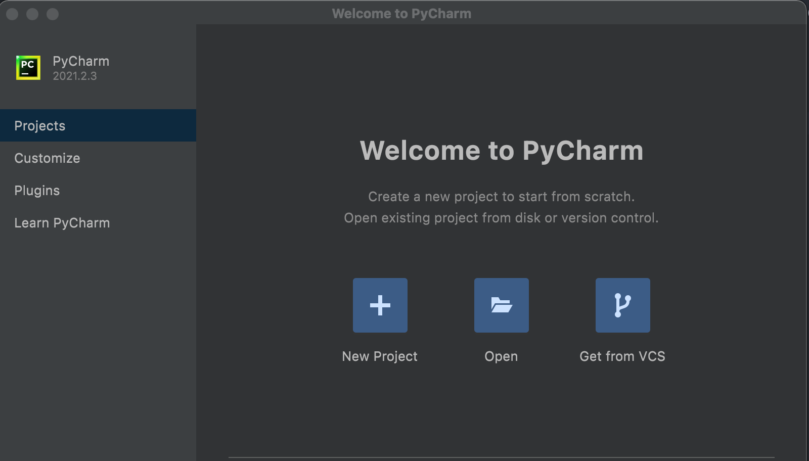
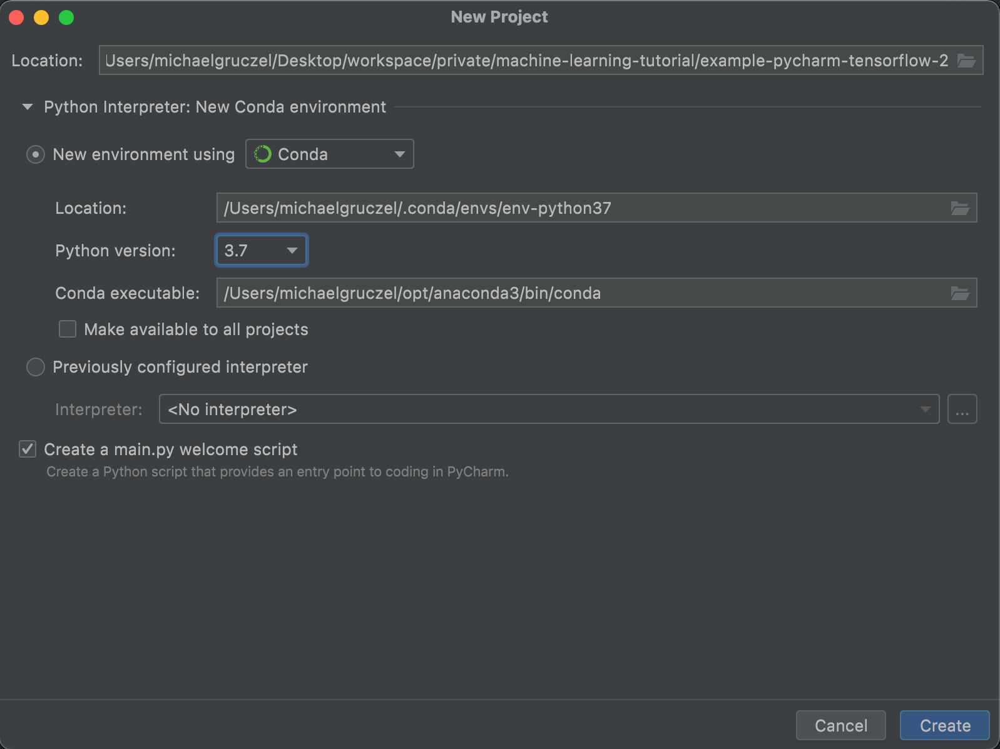
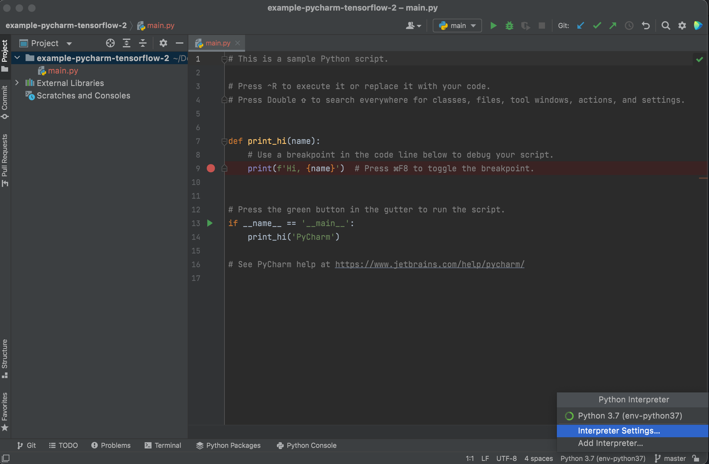
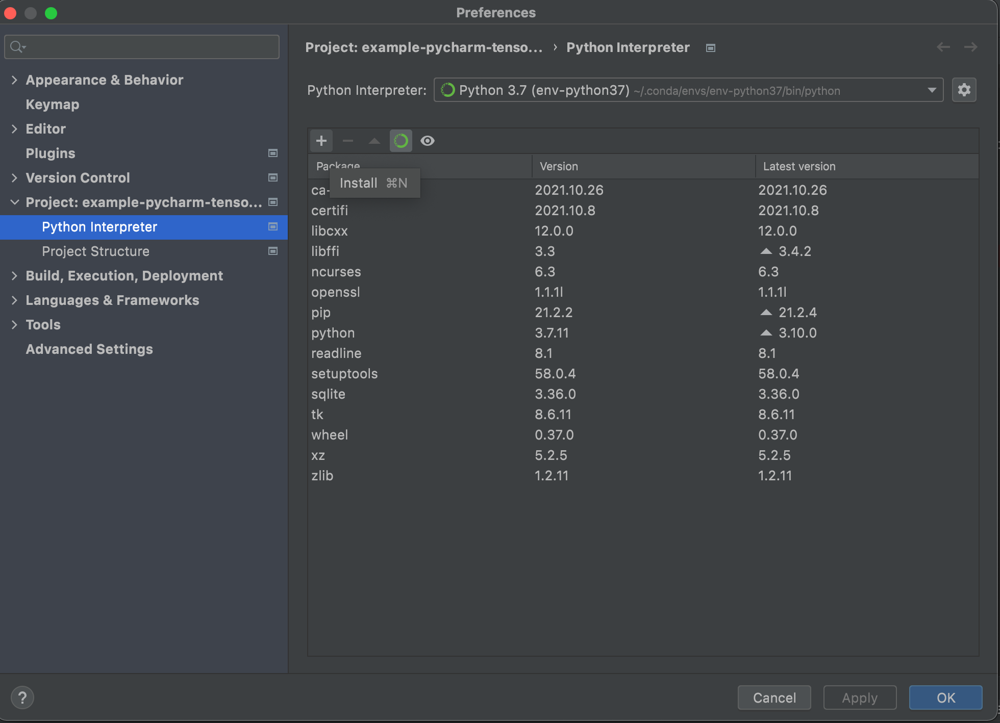
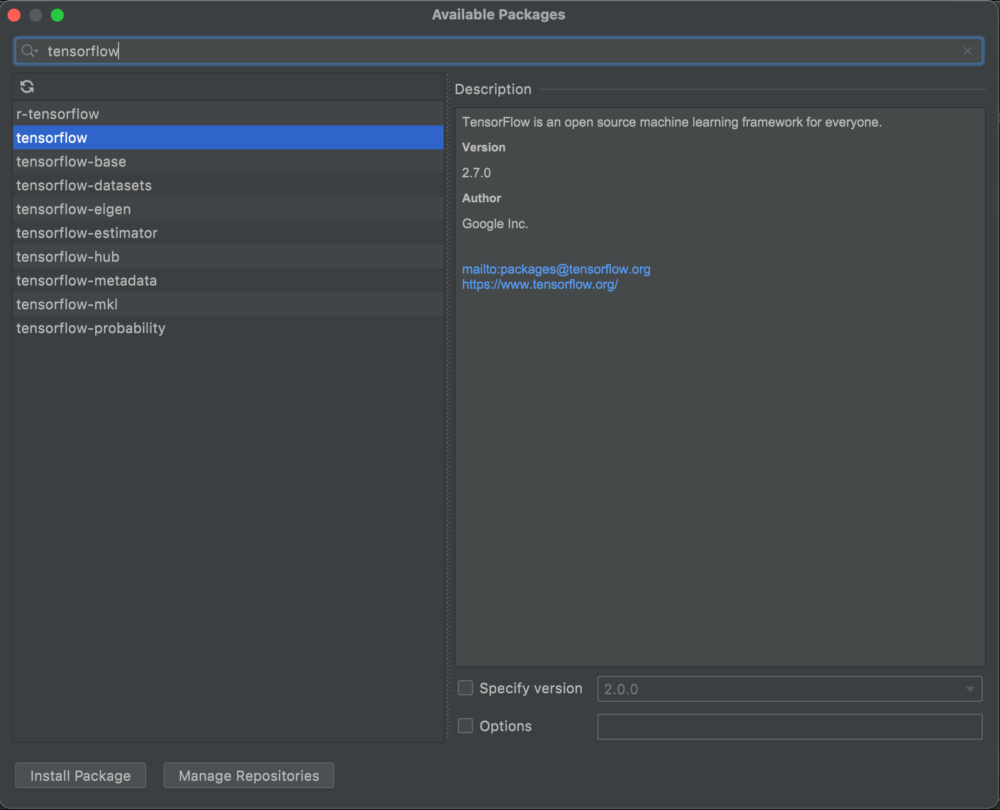

# install tools


## installation using anaconda

the anaconda data science toolkit / navigator is an installer which helps you to install the most important ml toolings. If you are not a command line fan, then thats a good starting point.

It is a programm which installs and starts JupyterLab, Jupyter Notebook, PyCharm Professional or RStudio for you.

https://www.anaconda.com/products/individual

## python an jupiter notebook from commandline

In order to work with several version in parallel we will use a vitual ml environment setup.
This commands are designed for a mac.

```
pip3 install --user --upgrade virtualenv
virtualenv mlenv
pip3 install --upgrade jupyter matplotlib numpy pandas scipy scikit-learn
python3 -c "import jupyter,matplotlib,numpy,pandas,scipy,sklearn"
pip install --upgrade tensorflow
python3 -c "import tensorflow; print (tensorflow.__version__)"
```

you can use jupyter in that virtual machine learning env later on by entering the folder and execute:

```
source mlenv/bin/activate
jupyter notebook
```

## python with tensorflow installed via PyCharm

jupiter is awe based tool, whereas pyCharm is an IDE which enables you to install virtuall machine learning environments. There is a free community edition.

https://www.jetbrains.com/pycharm/download/

I will show an example on how to setup a new project with python 3.7 and tensorflow.
User the same approach for other libs.

First we will set up a new project. As virtual machine learning env we will use conda this time.





now let's add tensorflow, go to Interpreter Settings and install the tensoflow package







Install other libs like numpy and matplot as well.
